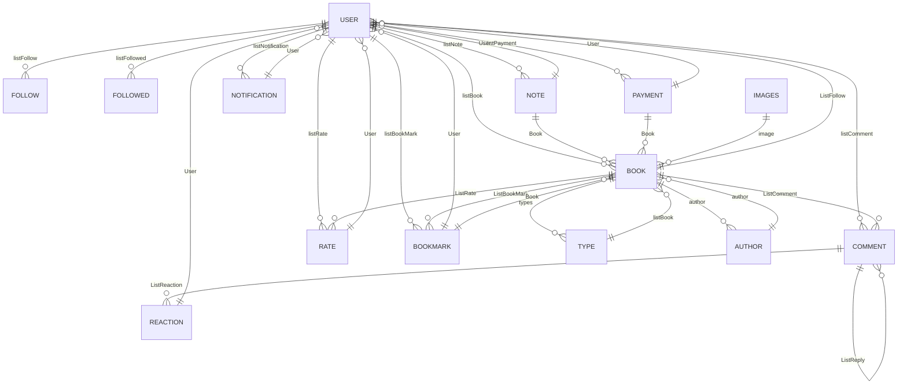
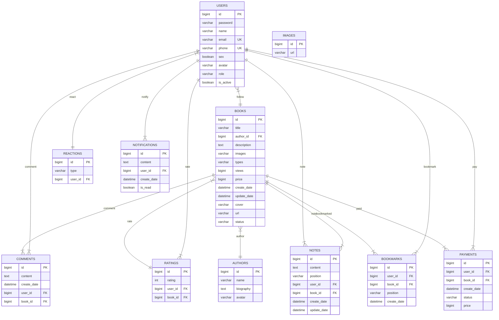

# Note

## Data Structure

### User -> Object

- id -> Long `UNIQUE` (khoá chính) [x]
- password -> String : `mật khẩu được mã hoá` [x]
- name -> String : `tên hiển thị`[x]
- email -> String `UNIQUE` : `email đăng nhập` [x]
- phone -> String `UNIQUE` : `số điện thoại`✅
- sex -> boolean : `true: nam, false: nữ`✅
- avatar -> `Images` : `link ảnh đại diện`✅
- Role -> List : `loại người dùng [User], [Admin], [Premium]`
- listBook -> `List<Book>` : `danh sách sách đã đăng`
- listComment -> `List<Comment>` : `danh sách đã comment`
- listRate -> `List<Rate>` : `danh sách đã đánh giá`
- listFollow -> `List<User>` : `danh sách người theo dõi`
- listFollowed -> `List<User>`: `danh sách người đang theo dõi`
- listNote -> `List<Note>` : `danh sách ghi chú`
- listNotification -> `List<Notification>` : `danh sách thông báo`
- isActived -> boolean : `true: đã kích hoạt, false: chưa kích hoạt`

### Book -> Object

- id -> Long `UNIQUE` (khoá chính) [x]
- title -> String : `tên sách` [x]
- author -> <Author.id> : `tác giả` (khoá ngoại) [ ]
- description -> String : `mô tả sách` [x]
<!-- - image -> `List<Image>` : `ảnh giới thiệu sách (nếu có)` -->
- types -> `List<Type>` : `thể loại` [ ]
- views -> Long : `lượt xem` [x]
- price -> Long : `giá bán` [x]
- DataCreate -> Date : `ngày tạo` [x]
- LastUpdate -> Date : `ngày cập nhật gần nhất` [x]
<!-- - Cover -> `Images` : `ảnh bìa` -->
- ListRate -> `List<Rate>` : `danh sách đánh giá` [x]
- ListComment -> `List<Comment>` : `danh sách comment` [ ]
- Url -> String : `link sách,file epub, pdf,...` [x]
- ListBookMark -> `List<BookMark>` : `danh sách vị trí bookmark` [ ]
- ListFollow -> `List<User>` : `danh sách người theo dõi` [x]
- Status -> `Status` : `[Đang tiến hành], [Đã hoàn thành], [Đã ngừng]` [x]

### Type -> Object

- id -> Long `UNIQUE` (khoá chính)
- name -> String : `tên thể loại`
- license -> boolean : `true: sách đã cấp bản quyền, false: sách chưa cấp bản quyền`
- listBook -> `List<Book>` : `danh sách sách thuộc thể loại`

### Comment -> Object

- id -> Long `UNIQUE` (khoá chính)
- content -> String : `nội dung comment`
- DataCreate -> Date : `ngày comment`
- User -> `User` <User.id> : `người comment` (khoá ngoại)
- Book -> `Book` <Book.id> : `sách được comment` (khoá ngoại)
- ListReply -> `List<Comment>` : `danh sách reply`
- ListReaction -> `List<Reaction>` : `danh sách reaction`

### Reaction -> Object

- id -> Long `UNIQUE` (khoá chính)
- type -> String : `loại reaction`
- User -> `User` <User.id> : `người reaction` (khoá ngoại)

### Rate -> Object

- id -> Long `UNIQUE` (khoá chính)
- rate -> int : `số sao (1->5 star)`
- User -> `User` <User.id> : `người đánh giá` (khoá ngoại)

### Images -> Object

- id -> Long `UNIQUE` (khoá chính)
- url -> String : `link ảnh`

### Note -> Object

- id -> Long `UNIQUE` (khoá chính)
- content -> String : `nội dung note`
<!-- vị trí của note -->
- Position -> String : `chưa rõ`
- User -> `User` <User.id> : `người note` (khoá ngoại)
- Book -> `Book` <Book.id> : `sách được note` (khoá ngoại)
- DataCreate -> Date : `ngày note`
- LastUpdate -> Date : `ngày cập nhật gần nhất`

### Notification -> Object

- id -> Long `UNIQUE` (khoá chính)
- content -> String : `nội dung thông báo`
- User -> `User` <User.id> : `người nhận` (khoá ngoại)
- DataCreate -> Date : `ngày tạo`
- isRead -> boolean : `true: đã đọc, false: chưa đọc`

### BookMark -> Object

- id -> Long `UNIQUE` (khoá chính)
- User -> `User` <User.id> : `người đánh dấu` (khoá ngoại)
- Book -> `Book` <Book.id> : `sách được đánh dấu` (khoá ngoại)
- DataCreate -> Date : `ngày đánh dấu`
<!-- vị trí của bookmark -->
- Position -> String : `chưa rõ`

### Author -> Object

- id -> Long `UNIQUE` (khoá chính)
- name -> String : `tên tác giả`
- biography -> String : `tiểu sử`
- avatar -> `Images` : `ảnh đại diện`

### Payment -> Object

- id -> Long `UNIQUE` (khoá chính)
- User -> `User` <User.id> : `người thanh toán` (khoá ngoại)
- Book -> `Book` <Book.id> : `sách được thanh toán` (khoá ngoại)
- DataCreate -> Date : `ngày thanh toán`
- Status -> `Status` : `[Đã thanh toán],[Chưa thanh toán],[Đang chờ],[Đã hủy]`
- Price -> Long : `giá tiền`
<!-- - PaymentMethod -> `PaymentMethod` : `[Momo],[ZaloPay],[PayPal],[Visa],[MasterCard],[JCB],[Cash]` -->

# ERD

---

